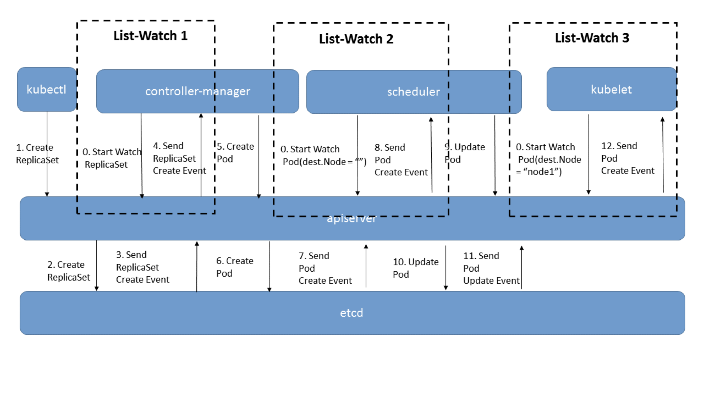

# 架构

## 组件

***

### Control Plane

控制平面的组件对集群做出全局决策(比如调度)，以及检测和响应集群事件（例如，当不满足部署的 `replicas` 字段时，启动新的 [pod](https://kubernetes.io/docs/concepts/workloads/pods/pod-overview/)）。

控制平面组件可以在集群中的任何节点上运行。然而，为了简单起见，设置脚本通常会在同一个计算机上启动所有控制平面组件，并且不会在此计算机上运行用户容器。

#### kube-apiserver

主节点上负责提供 Kubernetes API 服务的组件；它是 Kubernetes 控制面的前端。

kube-apiserver 在设计上考虑了水平扩缩的需要。 换言之，通过部署多个实例可以实现扩缩。 参见[构造高可用集群](https://kubernetes.io/docs/admin/high-availability/)。

#### etcd

etcd 是兼具一致性和高可用性的键值数据库，可以作为保存 Kubernetes 所有集群数据的后台数据库。

您的 Kubernetes 集群的 etcd 数据库通常需要有个备份计划。要了解 etcd 更深层次的信息，请参考 [etcd 文档](https://etcd.io/docs)。

#### kube-scheduler

主节点上的组件，该组件监视那些新创建的未指定运行节点的 Pod，并选择节点让 Pod 在上面运行。

调度决策考虑的因素包括单个 Pod 和 Pod 集合的资源需求、硬件/软件/策略约束、亲和性和反亲和性规范、数据位置、工作负载间的干扰和最后时限。

#### kube-controller-manager

在主节点上运行[控制器](https://kubernetes.io/docs/admin/kube-controller-manager/)的组件。

从逻辑上讲，每个[控制器](https://kubernetes.io/docs/admin/kube-controller-manager/)都是一个单独的进程，但是为了降低复杂性，它们都被编译到同一个可执行文件，并在一个进程中运行。

这些控制器包括:

- 节点控制器（Node Controller）: 负责在节点出现故障时进行通知和响应。
- 副本控制器（Replication Controller）: 负责为系统中的每个副本控制器对象维护正确数量的 Pod。
- 端点控制器（Endpoints Controller）: 填充端点(Endpoints)对象(即加入 Service 与 Pod)。
- 服务帐户和令牌控制器（Service Account & Token Controllers）: 为新的命名空间创建默认帐户和 API 访问令牌.

#### 云控制器管理器-(cloud-controller-manager)

[cloud-controller-manager](https://kubernetes.io/docs/tasks/administer-cluster/running-cloud-controller/) 运行与基础云提供商交互的控制器。cloud-controller-manager 二进制文件是 Kubernetes 1.6 版本中引入的 alpha 功能。

cloud-controller-manager 仅运行云提供商特定的控制器循环。您必须在 kube-controller-manager 中禁用这些控制器循环，您可以通过在启动 kube-controller-manager 时将 `--cloud-provider` 参数设置为 `external` 来禁用控制器循环。

cloud-controller-manager 允许云供应商的代码和 Kubernetes 代码彼此独立地发展。在以前的版本中，核心的 Kubernetes 代码依赖于特定云提供商的代码来实现功能。在将来的版本中，云供应商专有的代码应由云供应商自己维护，并与运行 Kubernetes 的云控制器管理器相关联。

以下控制器具有云提供商依赖性:

- 节点控制器（Node Controller）: 用于检查云提供商以确定节点是否在云中停止响应后被删除
- 路由控制器（Route Controller）: 用于在底层云基础架构中设置路由
- 服务控制器（Service Controller）: 用于创建、更新和删除云提供商负载均衡器
- 数据卷控制器（Volume Controller）: 用于创建、附加和装载卷、并与云提供商进行交互以编排卷

***

### Node

节点组件在每个节点上运行，维护运行的 Pod 并提供 Kubernetes 运行环境。

#### kubelet

一个在集群中每个节点上运行的代理。它保证容器都运行在 Pod 中。

kubelet 接收一组通过各类机制提供给它的 PodSpecs，确保这些 PodSpecs 中描述的容器处于运行状态且健康。kubelet 不会管理不是由 Kubernetes 创建的容器。

#### kube-proxy

[kube-proxy](https://kubernetes.io/docs/reference/command-line-tools-reference/kube-proxy/) 是集群中每个节点上运行的网络代理,实现 Kubernetes [Service](https://kubernetes.io/docs/concepts/services-networking/service/) 概念的一部分。

kube-proxy 维护节点上的网络规则。这些网络规则允许从集群内部或外部的网络会话与 Pod 进行网络通信。

如果操作系统提供了数据包过滤层并可用的话，kube-proxy会通过它来实现网络规则。否则，kube-proxy 仅转发流量本身。

#### 容器运行环境(Container Runtime)

容器运行环境是负责运行容器的软件。

Kubernetes 支持多个容器运行环境: [Docker](http://www.docker.com/)、 [containerd](https://containerd.io/)、[cri-o](https://cri-o.io/)、 [rktlet](https://github.com/kubernetes-incubator/rktlet) 以及任何实现 [Kubernetes CRI (容器运行环境接口)](https://github.com/kubernetes/community/blob/master/contributors/devel/sig-node/container-runtime-interface.md)。

***

### 插件(Addons)

插件使用 Kubernetes 资源 ([DaemonSet](https://kubernetes.io/docs/concepts/workloads/controllers/daemonset), [Deployment](https://kubernetes.io/docs/concepts/workloads/controllers/deployment/)等) 实现集群功能。因为这些提供集群级别的功能，所以插件的命名空间资源属于 `kube-system` 命名空间。

所选的插件如下所述：有关可用插件的扩展列表，请参见[插件 (Addons)](https://kubernetes.io/docs/concepts/cluster-administration/addons/)。

#### DNS

尽管并非严格要求其他附加组件，但所有示例都依赖[集群 DNS](https://kubernetes.io/docs/concepts/services-networking/dns-pod-service/)，因此所有 Kubernetes 集群都应具有 DNS。

除了您环境中的其他 DNS 服务器之外，集群 DNS 还是一个 DNS 服务器，它为 Kubernetes 服务提供 DNS 记录。

Cluster DNS 是一个 DNS 服务器，和您部署环境中的其他 DNS 服务器一起工作，为 Kubernetes 服务提供DNS记录。

Kubernetes 启动的容器自动将 DNS 服务器包含在 DNS 搜索中。

#### 用户界面(Dashboard)

[Dashboard](https://kubernetes.io/docs/tasks/access-application-cluster/web-ui-dashboard/) 是 Kubernetes 集群的通用基于 Web 的 UI。它使用户可以管理集群中运行的应用程序以及集群本身并进行故障排除。

#### 容器资源监控

[容器资源监控](https://kubernetes.io/docs/tasks/debug-application-cluster/resource-usage-monitoring/)将关于容器的一些常见的时间序列度量值保存到一个集中的数据库中，并提供用于浏览这些数据的界面。

#### 集群层面日志

[集群层面日志](https://kubernetes.io/docs/concepts/cluster-administration/logging/) 机制负责将容器的日志数据保存到一个集中的日志存储中，该存储能够提供搜索和浏览接口。

***

## 工作流程

***

