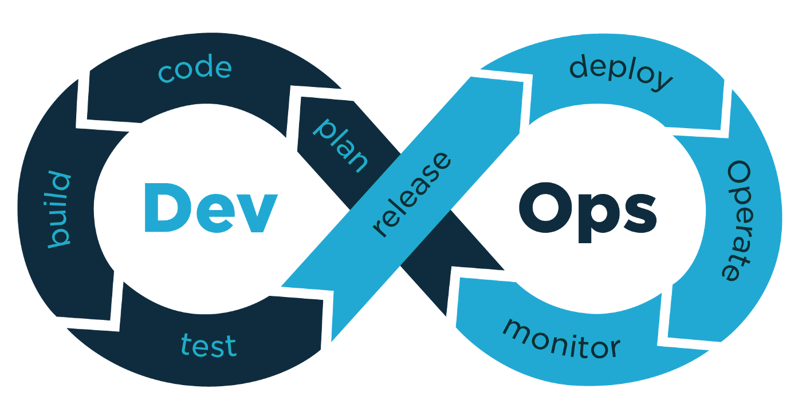

# DevOps

### 什么是DevOps？

wiki

> DevOps（开发 Development 与运维 Operations 的组合词）是一种文化、一场运动或实践，强调在自动化软件交付流程及基础设施变更过程中，软件开发人员与其他信息技术（IT）专业人员彼此之间的协作与沟通。它旨在建立一种文化与环境，使构建、测试、软件发布得以快速、频繁以及更加稳定地进行。

亚马逊

> DevOps is the combination of cultural philosophies, practices, and tools that increases an organization’s ability to deliver applications and services at high velocity: evolving and improving products at a faster pace than organizations using traditional software development and infrastructure management processes. This speed enables organizations to better serve their customers and compete more effectively in the market.

微软

> DevOps is the union of people, process, and products to enable continuous delivery of value to our end users. The contraction of “Dev” and “Ops” refers to replacing siloed Development and Operations to create multidisciplinary teams that now work together with shared and efficient practices and tools. Essential DevOps practices include agile planning, continuous integration, continuous delivery, and monitoring of applications.

红帽

> DevOps describes approaches to speeding up the processes by which an idea (like a new software feature, a request for enhancement, or a bug fix) goes from development to deployment in a production environment where it can provide value to the user. These approaches require that development teams and operations teams communicate frequently and approach their work with empathy for their teammates. Scalability and flexible provisioning are also necessary. With DevOps, those that need power the most, get it—through self service and automation. Developers, usually coding in a standard development environment, work closely with IT operations to speed software builds, tests, and releases—without sacrificing reliability.

***

