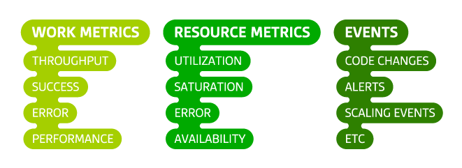

# Monitor

## Collect

#### 做什么

1. 收到有意义的自动化警报，以解决潜在问题。
2. 快速调查并深入了解性能问题。

> *Collecting data is cheap, but not having it when you need it can be expensive, so you should instrument everything, and collect all the useful data you reasonably can.*

### Metric

Metric在特定时间点捕获与您的系统有关的值,

***

#### Work Metric

Work metrics 通过衡量有用的输出来指示系统的顶级运行状况。

* 吞吐量
* 成功率
* 错误
* 性能(延迟)

**Example work metrics: Web server**

| **Subtype** | **Description**                                             | **Value** |
| ----------- | ----------------------------------------------------------- | --------- |
| throughput  | requests per second                                         | 312       |
| success     | percentage of responses that are 2xx since last measurement | 99.1      |
| error       | percentage of responses that are 5xx since last measurement | 0.1       |
| performance | 90th percentile response time in seconds                    | 0.4       |

***

#### Resource Metric

* 利用率
* 饱和度
* 错误
* 可用性

Here are example metrics for a handful of common resource types:

| **Resource** | **Utilization**                                       | **Saturation**      | **Errors**                                  | **Availability**             |
| ------------ | ----------------------------------------------------- | ------------------- | ------------------------------------------- | ---------------------------- |
| Disk IO      | % time that device was busy                           | wait queue length   | # device errors                             | % time writable              |
| Memory       | % of total memory capacity in use                     | swap usage          | N/A (not usually observable)                | N/A                          |
| Microservice | average % time each request-servicing thread was busy | # enqueued requests | # internal errors such as caught exceptions | % time service is reachable  |
| Database     | average % time each connection was busy               | # enqueued queries  | # internal errors, e.g. replication errors  | % time database is reachable |

***

### 四大特征

* 清晰，保持指标和事件尽可能简单，并明确命名
* 粒状，
* 按范围标记，保留与数据关联的多个作用域非常重要，这样您就可以警告任何作用域的问题，并快速调查中断，而不受固定主机层次结构的限制
* 保留时长

***

#### 总结

* 记录一切，并尽可能收集尽可能多的工作指标，资源指标和事件。复杂系统的可观察性要求全面的测量。
* 以足够的粒度收集指标，以使重要的峰值和下降可见。
* 为了最大程度地发挥数据的价值，请在多个范围内标记指标和事件，并将其完整粒度保留至少15个月。

***

## Alert

### 告警等级

1. 记录(低等级)
2. 通知(中等)
3. 页面、电话等(紧急)

#### 总结

仅在系统出现紧急问题的症状时发送页面 检测到工作，或者是否存在关键且有限的资源限制 即将达到

设置您的监视系统以在检测到警报时记录警报 基础架构中的实际问题，即使这些问题没有 尚未影响整体表现

***

## 恢复

1. 查看work指标
2. 查看资源指标
3. 是否做过变更
4. 修复并不忘记它

***

### 总结

遵循标准化的监视框架，您可以更系统地调查问题：

* 对于基础架构中的每个系统，请提前设置一个仪表板，以显示其所有关键指标并覆盖相关事件
* 通过从显示症状的最高级别系统开始，调查其原因，审查其工作和资源指标以及任何相关事件，以调查问题的原因
* 如果检测到有问题的资源，则对资源（及其组成资源）应用相同的调查模式，直到发现并纠正根本问题为止