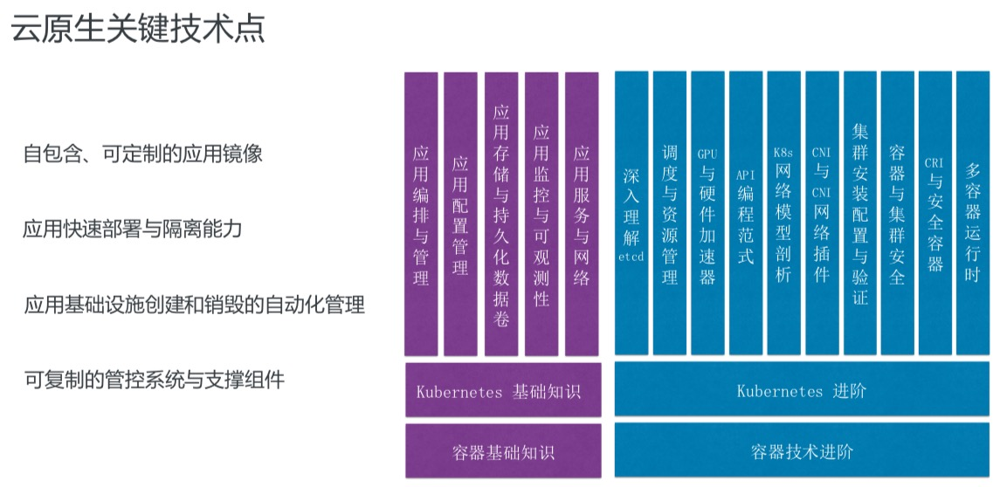

# 云原生

### What

#### CNCF定义

>Cloud native technologies empower organizations to build and run scalable applications in modern, dynamic environments such as public, private, and hybrid clouds. Containers, service meshes, microservices, immutable infrastructure, and declarative APIs exemplify this approach.
>
>These techniques enable loosely coupled systems that are resilient, manageable, and observable. Combined with robust automation, they allow engineers to make high-impact changes frequently and predictably with minimal toil.

#### Pivotal定义

> Cloud native is an approach to building and running applications that exploits the advantages of the cloud computing delivery model. Cloud native is about how applications are created and deployed, not where
>
> Organizations require a platform for building and operating cloud native applications and services that automates and integrates the concepts of DevOps, continuous delivery, microservices, and containers

***

### 阿里云原生课堂

#### 定义

> 云原生是一条使用户能:
>  1.低心智负担的、
>  2.敏捷的、
>  3.以可扩展、可复制的方式， 最大化的利用”云“的能力、发挥”云“的价值的最佳路径

***

#### 技术范畴

* 云应用定义与开发流程
  1. 应用定义与镜像制作 
  2. CI/CD
  3. 消息和 Streaming 
  4. 数据库
* 云应用编排与管理
  1. 应用编排与调度
  2. 服务发现与治理
  3. 远程调用
  4. API 网关
  5. Service Mesh
* 监控与可观测性
  1. 监控
  2. 日志
  3. Tracing
  4. 混沌工程
* 云原生底层技术
  1. 容器运行时
  2. 云原生存储技术
  3. 云原生网络技术
* 云原生工具集
  1. 流程自动化与配置管理
  2. 容器镜像仓库
  3. 云原生安全技术
  4. 云端密码管理
* Serverless
  1. FaaS
  2. BaaS
  3. Serverless
  4. 计费

***

#### 理论基础

* 不可变基础设施

  目前实现：容器镜像

* 云应用编排理论

  目前实现：容器设计模式

***

#### 关键技术点

