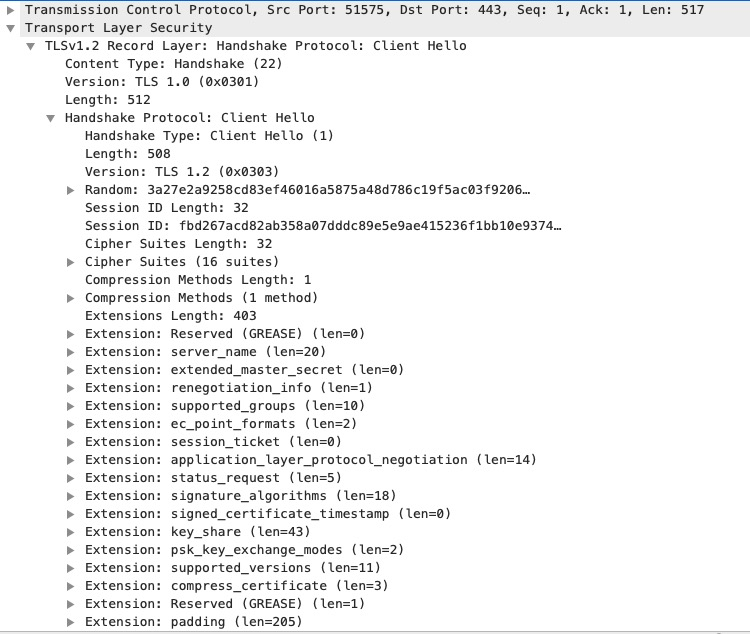
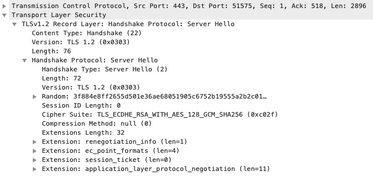
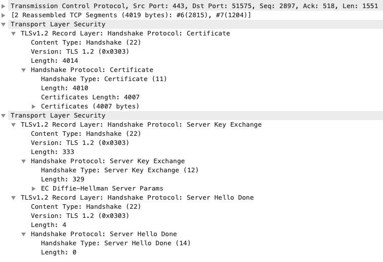
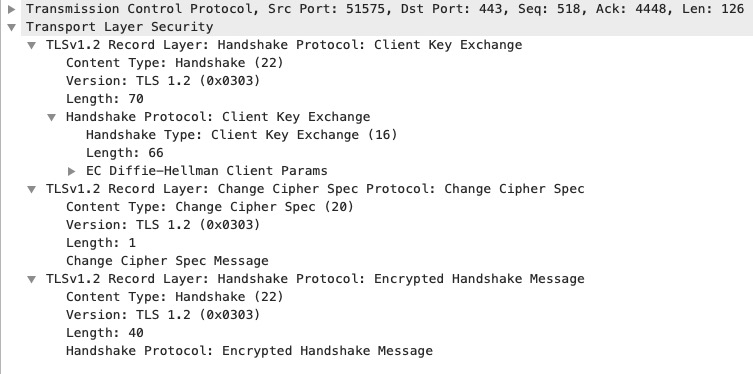
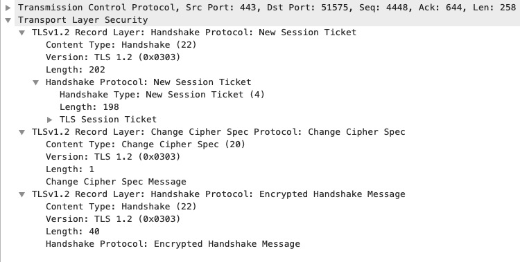

# SSL协议

SSL是一种安全协议，目的是为互联网通信提供安全及数据完整性保障。

* [SSL介绍](#1)

* [工作机制](#2)

* [工具使用](#3)

***

<h3 id="1">SSL介绍</h3>

#### 一个简单的工作流程:

1. 浏览器请求一个安全页面(https://)。

2. Web服务器返回公钥及其证书。

3. 浏览器检查该证书是否由可信任的机构颁发，并且是与站点相关的有效证书。

4. 浏览器使用公钥加密随即对称加密密钥，和通过随即加密密钥加密的http数据一同发送给Web服务器。

5. Web服务器通过私钥解密随即对称加密密钥，并使用它解密http数据。

6. Web服务器返回通过随即对称加密密钥加密的请求html文本和http数据。

7. 浏览器通过随即对称加密密钥解密html文本和http数据并展示信息。

***

#### 公私钥:

非对称加密，使用私钥/公钥对加密，数据可以被一个密钥加密，但只能被另一个密钥对解密。该密钥对自己保留一个私钥，并将公钥分配给每个人。

    Message --> [Public Key] --> Encrypted Message --> [Private Key] --> Message

***

#### 证书:

证书加载在浏览器或者其他客户端党当中，证书包含了证书所有者的信息。一个例子: 

    Certificate: 
        Data: 
            Version: 3 (0x2) 
            Serial Number: 1 (0x1) 
            Signature Algorithm: md5WithRSAEncryption 
            Issuer: C=FJ, ST=Fiji, L=Suva, O=SOPAC, OU=ICT, CN=SOPAC Root CA/Email=administrator@sopac.org 
            Validity 
                Not Before: Nov 20 05:47:44 2001 GMT 
                Not After : Nov 20 05:47:44 2002 GMT 
            Subject: C=FJ, ST=Fiji, L=Suva, O=SOPAC, OU=ICT, CN=www.sopac.org/Email=administrator@sopac.org 
            Subject Public Key Info: 
                Public Key Algorithm: rsaEncryption  
                RSA Public Key: (1024 bit) 
                    Modulus (1024 bit): 
                        00:ba:54:2c:ab:88:74:aa:6b:35:a5:a9:c1:d0:5a: 
                        9b:fb:6b:b5:71:bc:ef:d3:ab:15:cc:5b:75:73:36: 
                        b8:01:d1:59:3f:c1:88:c0:33:91:04:f1:bf:1a:b4: 
                        7a:c8:39:c2:89:1f:87:0f:91:19:81:09:46:0c:86: 
                        08:d8:75:c4:6f:5a:98:4a:f9:f8:f7:38:24:fc:bd: 
                        94:24:37:ab:f1:1c:d8:91:ee:fb:1b:9f:88:ba:25: 
                        da:f6:21:7f:04:32:35:17:3d:36:1c:fb:b7:32:9e: 
                        42:af:77:b6:25:1c:59:69:af:be:00:a1:f8:b0:1a: 
                        6c:14:e2:ae:62:e7:6b:30:e9 
                    Exponent: 65537 (0x10001) 
             X509v3 extensions: 
                 X509v3 Basic Constraints: 
                     CA:FALSE 
                 Netscape Comment: 
                     OpenSSL Generated Certificate
                 X509v3 Subject Key Identifier:
                     FE:04:46:ED:A0:15:BE:C1:4B:59:03:F8:2D:0D:ED:2A:E0:ED:F9:2F 
                 X509v3 Authority Key Identifier:
                     keyid:E6:12:7C:3D:A1:02:E5:BA:1F:DA:9E:37:BE:E3:45:3E:9B:AE:E5:A6 
                     DirName:/C=FJ/ST=Fiji/L=Suva/O=SOPAC/OU=ICT/CN=SOPAC Root CA/Email=administrator@sopac.org 
                     serial:00
        Signature Algorithm: md5WithRSAEncryption
            34:8d:fb:65:0b:85:5b:e2:44:09:f0:55:31:3b:29:2b:f4:fd: 
            aa:5f:db:b8:11:1a:c6:ab:33:67:59:c1:04:de:34:df:08:57: 
            2e:c6:60:dc:f7:d4:e2:f1:73:97:57:23:50:02:63:fc:78:96: 
            34:b3:ca:c4:1b:c5:4c:c8:16:69:bb:9c:4a:7e:00:19:48:62: 
            e2:51:ab:3a:fa:fd:88:cd:e0:9d:ef:67:50:da:fe:4b:13:c5: 
            0c:8c:fc:ad:6e:b5:ee:40:e3:fd:34:10:9f:ad:34:bd:db:06: 
            ed:09:3d:f2:a6:81:22:63:16:dc:ae:33:0c:70:fd:0a:6c:af:
            bc:5a 
    -----BEGIN CERTIFICATE----- 
    MIIDoTCCAwqgAwIBAgIBATANBgkqhkiG9w0BAQQFADCBiTELMAkGA1UEBhMCRkox 
    DTALBgNVBAgTBEZpamkxDTALBgNVBAcTBFN1dmExDjAMBgNVBAoTBVNPUEFDMQww 
    CgYDVQQLEwNJQ1QxFjAUBgNVBAMTDVNPUEFDIFJvb3QgQ0ExJjAkBgkqhkiG9w0B 
    CQEWF2FkbWluaXN0cmF0b3JAc29wYWMub3JnMB4XDTAxMTEyMDA1NDc0NFoXDTAy 
    MTEyMDA1NDc0NFowgYkxCzAJBgNVBAYTAkZKMQ0wCwYDVQQIEwRGaWppMQ0wCwYD 
    VQQHEwRTdXZhMQ4wDAYDVQQKEwVTT1BBQzEMMAoGA1UECxMDSUNUMRYwFAYDVQQD 
    Ew13d3cuc29wYWMub3JnMSYwJAYJKoZIhvcNAQkBFhdhZG1pbmlzdHJhdG9yQHNv 
    cGFjLm9yZzCBnzANBgkqhkiG9w0BAQEFAAOBjQAwgYkCgYEAulQsq4h0qms1panB 
    0Fqb+2u1cbzv06sVzFt1cza4AdFZP8GIwDORBPG/GrR6yDnCiR+HD5EZgQlGDIYI 
    2HXEb1qYSvn49zgk/L2UJDer8RzYke77G5+IuiXa9iF/BDI1Fz02HPu3Mp5Cr3e2 
    JRxZaa++AKH4sBpsFOKuYudrMOkCAwEAAaOCARUwggERMAkGA1UdEwQCMAAwLAYJ 
    YIZIAYb4QgENBB8WHU9wZW5TU0wgR2VuZXJhdGVkIENlcnRpZmljYXRlMB0GA1Ud
    DgQWBBT+BEbtoBW+wUtZA/gtDe0q4O35LzCBtgYDVR0jBIGuMIGrgBTmEnw9oQLl 
    uh/anje+40U+m67lpqGBj6SBjDCBiTELMAkGA1UEBhMCRkoxDTALBgNVBAgTBEZp 
    amkxDTALBgNVBAcTBFN1dmExDjAMBgNVBAoTBVNPUEFDMQwwCgYDVQQLEwNJQ1Qx 
    FjAUBgNVBAMTDVNPUEFDIFJvb3QgQ0ExJjAkBgkqhkiG9w0BCQEWF2FkbWluaXN0 
    cmF0b3JAc29wYWMub3JnggEAMA0GCSqGSIb3DQEBBAUAA4GBADSN+2ULhVviRAnw 
    VTE7KSv0/apf27gRGsarM2dZwQTeNN8IVy7GYNz31OLxc5dXI1ACY/x4ljSzysQb 
    xUzIFmm7nEp+ABlIYuJRqzr6/YjN4J3vZ1Da/ksTxQyM/K1ute5A4/00EJ+tNL3b 
    Bu0JPfKmgSJjFtyuMwxw/Qpsr7xa
    -----END CERTIFICATE-----

该证书包含对发行人的引用，该证书的所有者的公钥，该证书的有效期和证书的签名，以确保该证书没有被篡改。

***

#### 对称密钥:

对称加密，使用相同密钥进行加密和解密。对称加密在处理速度上比非对称加密快，但安全性低。综合考虑，使用公私钥加解密对称密钥，在每次事务都选择不同的对称密钥是更安全和高效的方案。

    Symetric Key --> [Public Key] --> Encrypted Symetric Key --> [Private Key] --> Symetric Key

***

#### 加密算法:

加密算法有对称和非对称方法，使用不同长度的密钥。

***

#### Hash

哈希是由消息中的哈希函数给出的数字。 这是一个单向函数，这意味着不可能得到原始消息知道哈希。 然而，即使消息中最轻微的修改，哈希也会发生巨大变化。 因此，在保持其原始散列的同时修改消息是非常困难的。它也被成为消息摘要。哈希函数用于密码机制，用于证明应用程序是原始的（MD5总和），确保任何消息未被篡改。

***

#### 签名

签署信息意味着验证您已经确定了邮件的真实性。要签署消息，需要创建其Hash，然后使用私钥加密Hash，然后添加加密Hash和签名的证书与消息。
收件人将重新创建消息hash，使用签名的证书中存储的公钥解密加密Hash，检查两个Hash是否相等，最后检查证书。

***

#### PassPhrase

PassPhrase就像一个密码，除了它更长。

***

#### PKI

Public Key Infrastructure（PKI）是软件管理系统和数据库系统，允许签署证书，保留撤销证书清单，分发公钥。

***

#### CSRs

要从CA获取SSL证书，就要生成一个certificate signing request (CSR)。CSR由密钥对的公钥和一些附加信息组成。这两个组件在签名时都会插入证书。

生成CSR需要填入的信息：

    ---
    Country Name (2 letter code) [AU]:US
    State or Province Name (full name) [Some-State]:New York
    Locality Name (eg, city) []:Brooklyn
    Organization Name (eg, company) [Internet Widgits Pty Ltd]:Example Brooklyn Company
    Organizational Unit Name (eg, section) []:Technology Division
    Common Name (e.g. server FQDN or YOUR name) []:examplebrooklyn.com
    Email Address []:

***

<h3 id="2">工作机制</h3>

TLS协议由两部分组成，包括（TLS Record Layer,TLS handshake protocol）

* Record Layer:

    为每条信息提供一个header和在尾部生成一个从Message Authentication Code (MAC) 得到的hash值，其中header由5 bytes组成，分别是协议说明(1bytes),协议版本(2bytes)和长度(2bytes)，跟在header后面的协议信息长度不得超过16384bytes。

* Handshake Protocol:

    TLS握手:

    

***

<h3 id="3">OpenSSl工具</h3>

OpenSSL是一个通用的命令行工具，可用于与公钥基础设施（PKI）和HTTPS（TLS over HTTP）相关的各种任务。

#### 生成CSRs

    #生成一个私钥和一个CSR
    openssl req -newkey rsa:2048 -nodes -keyout domain.key -out domain.csr
    
    #使用已存在的私钥生成CSR
    openssl req -key domain.key -new -out domain.csr

***

#### 生成SSL证书

    #生成一个私钥和自签名证书
    openssl req -newkey ras:2048 -keyout domain.key -x509 -days 365 -out domain.crt
    
    #使用已存在的私钥生成自签名证书
    openssl req -key domain.key -x509 -days 365 -out domain.crt
    
    #使用已存在的私钥和CSR生成自签名证书
    openssl x509 -signkey domain.key -in domain.csr -req -days 365 -out domain.crt

***

#### 查看证书

    #查看CSR信息
    openssl req -text -noout -verify -in domain.csr
    
    #查看证书信息
    openssl x509 -text -noout -in domain.crt
    
    #验证证书是呦CA签署的
    openssl verify -verbose -CAFile ca.crt domain.crt

***

#### 生成私钥

    #创建私钥文件
    openssl genrsa -des3 -out domain.key 2048
    
    #查看私钥信息
    openssl rsa -check -in domain.key

***

#### 证书格式转换

    #PEM转DER
    openssl x509 -in domain.crt -outform der -out domain.der
    
    #DER转PEM
    openssl x509 -inform der -in domain.der -out domain.crt
    
    #PEM转PKCS7
    openssl crl2pkcs7 -nocrl -certfile domain.crt -certfile ca-chain.crt -out domain.p7b
    
    #PKCS7转PEM
    openssl pkcs7 -in domain.p7b -print_certs -out domain.crt
    
    #PEM转PKCS12
    openssl pkcs12 -inkey domain.key -in domain.crt -export -out domain.pfx
    
    #PKCS12转PEM
    openssl pkcs12 -in domain.pfx -nodes -out domain.combined.crt
***

### 抓包

#### process

#### client_hello

***

#### server_hello

***

#### server_key_exchange

***

#### client_key_exchange

***

#### new session

***

