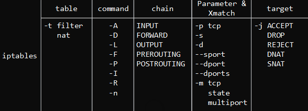

# Iptables

iptables：一个运行在用户空间的应用软件，通过控制Linux内核[netfilter](../filter/netfilter.md)模块，来管理网络数据包的流动与转送。

***

### 规则编写

命令格式：iptables -t TABLE command CHAIN parameter match -j TARGET

 command             | 描述  
 --------            | ----- 
 -P  --policy        | 定义默认策略
 -L  --list          |  查看iptables规则列表
 -A  --append        |  在规则列表的最后增加1条规则
 -I  --insert        |  在指定的位置插入1条规则
 -D  --delete        |  从规则列表中删除1条规则
 -R  --replace       |  替换规则列表中的某条规则
 -F  --flush         |  删除表中所有规则
 -Z  --zero          |  将表中数据包计数器和流量计数器归零
 -X  --delete-chain  |  删除自定义链
 -v  --verbose       |  与-L他命令一起使用显示更多更详细的信息
 -nL                 | 查看当前运行的防火墙规则列表

parameter            | match           | 描述
-------------------- |--------------   | -----
-i --in-interface    | 网络接口名>     | 指定数据包从哪个网络接口进入，
-o --out-interface   | 网络接口名>     | 指定数据包从哪个网络接口输出
-p ---proto          | 协议类型        | 指定数据包匹配的协议，如TCP、UDP和ICMP等
-s --source          | 源地址或子网>   | 指定数据包匹配的源地址
   --sport           | 源端口号>       | 指定数据包匹配的源端口号
-d --destination     | 目的地址或子网> | 指定数据包匹配的目的地址   
   --dport           | 目的端口号>     | 指定数据包匹配的目的端口号
-m --match           | 匹配的模块      | 指定数据包规则所使用的过滤模块

-m：extend matches，这个选项用于提供更多的匹配参数，如：

	-m state –-state ESTABLISHED,RELATED
	-m tcp –-dport 22
	-m multiport –-dports 80,8080
	-m icmp –-icmp-type 8

***

