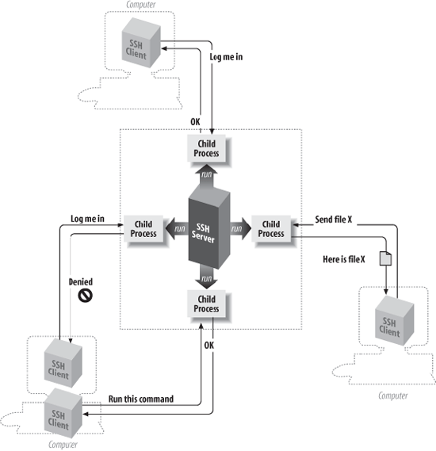

# SSH

### 概念

安全Shell（SSH）是一种加密网络协议，用于通过无安全网络安全地运行网络服务。

#### SSH协议

* 认证

* 加密

* 完整性

#### SSH属性

* 安全远程登录(Secure Remote Login )

* 安全文件传输(Secure File Transfer)

* 安全远程命令执行(Secure Remote Command Execution)

* 密钥和代理(Keys and Agents)

* 访问控制(Access Control)

* 端口转发(Port Forwarding)

#### 架构

***

### 基础操作

1. 远程登录

      ssh -l USERNAME HOST -p PORT

2. 文件传输

      scp SOURCE DESTINATION

3. 已知主机(known hosts)

    known hosts可以用来防止中间人攻击。
    每个SSH服务器都有一个秘密的唯一ID，称为主机密钥(host key)，用于向客户端标识自身。当首次连接的时，ssh会记录目标设备的host key到~/.ssh/known_hosts文件，当主机密钥发生改变时，在连接时将会有提示告警。

4. 转义字符(The Escape Character)

    转义字符可以用于暂时中断连接，默认符号为"~"
    也可以自行进行更改，使用-e选项，ssh -e "#" HOST

#### 加密密钥认证(Authentication by Cryptographic Key)

密码认证方式的缺陷：
    
* 安全的密码复杂性高，难于记忆。
* 通过网络传输密码还是会有被捕获的风险。

SSH支持公钥认证的方式，可以解决上述的密码问题。

1. 密钥简介

key是一个数字身份，是一个独特的二进制字符串。

SSH身份使用一对密钥，一个私有密钥和一个公有密钥。私钥由自身保管，公钥保存在需要访问的ssh服务器上。(~/.ssh/authorized_keys)文件。

    client请求登录server
    server要求身份认证
    client发送自身私钥证明自己身份
    server使用公钥对私钥进行匹配，成功则允许登录。

2. ssh-keygen生成密钥对

    (ssh-keygen -t dsa|rsa) | (ssh-keygen)
    会在~/.ssh/目录生成id_rsa和id_rsa.pub两个文件 

3. 在ssh服务器上安装公钥

    * 直接编辑~/.ssh/authorized_keys(权限644),拷贝id_rsa.pub的内容到该文件
    * 使用ssh-copy-id 
        ssh-copy-id -i id_rsa.pub [user@]server_name

***

### SSH深入

* 加密

* 完整性

* 认证

* 授权

* 转发

#### 密码学入门

