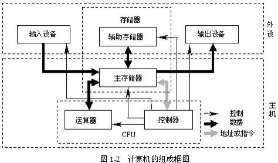
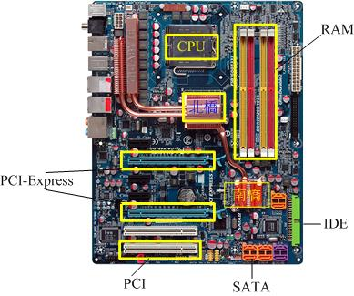
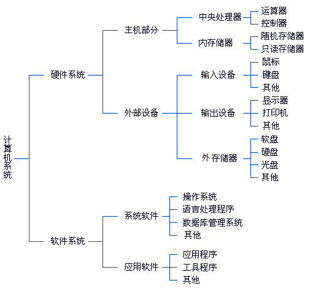

# 计算机组成

### 计算机组成

计算机(computer)：一种利用电子学原理，根据一系列指令来对数据进行处理的工具。

***

#### 硬件

* 控制器：负责对程序规定的控制信息进行分析,控制并协调输入,输出操作或内存访问。

* 运算器：负责数据的算术运算和逻辑运算即数据的加工处理。

* 存储器：实现记忆功能的部件用来存放计算程序及参与运算的各种数据。

* 输入设备：实现计算程序和原始数据的输入

* 输出设备：实现计算结果输出

图示：

***

#### 软件

* 系统软件：负责管理计算机系统中各种独立的硬件，使得它们可以协调工作，提供基本的功能，并为正在运行的应用软件提供平台。

* 应用软件：为了某种特定的用途而被开发的软件。

***

#### 计算机工作过程

1. 用户打开程序

2. 系统把程序代码段和数据段送入计算机的内存

3. 控制器从存储器中取指令

4. 控制器分析,执行指令,为取下一条指令做准备

5. 取下一条指令,分析执行,如此重复操作,直至执行完程序中全部指令,便可获得全部指令

图示：

***

#### 计算机系统结构

	

***

