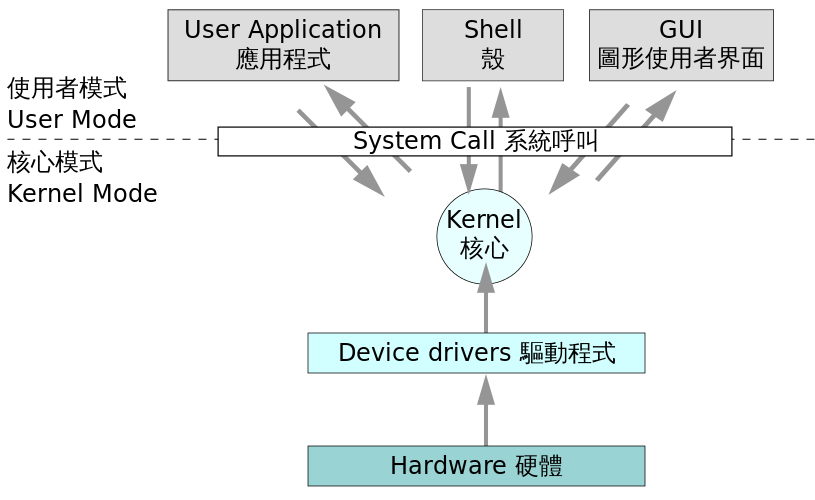
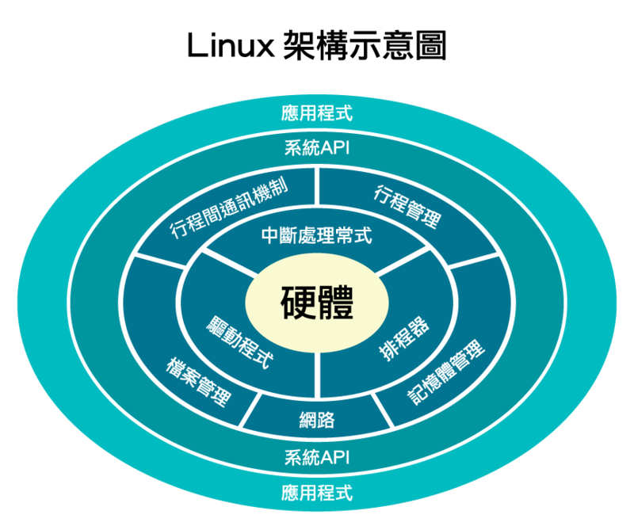

# 操作系统

操作系统(operating system)：是管理计算机硬件与软件资源的计算机程序，同时也是计算机系统的内核与基石。操作系统需要处理如管理与配置内存、决定系统资源供需的优先次序、控制输入与输出设备、操作网络与管理文件系统等基本事务。操作系统也提供一个让用户与系统交互的操作界面。

***

#### 结构

* 驱动程序：最底层的、直接控制和监视各类硬件的部分，它们的职责是隐藏硬件的具体细节，并向其他部分提供一个抽象的、通用的接口。

* 内核：操作系统之最内核部分，通常运行在最高特权级，负责提供基础性、结构性的功能。

* 函数库(接口库)：是一系列特殊的程序库，它们职责在于把系统所提供的基本服务包装成应用程序所能够使用的编程接口（API），是最靠近应用程序的部分。

* 外围：所谓外围，是指操作系统中除以上三类以外的所有其他部分，通常是用于提供特定高级服务的部件。

图示：

***

Linux系统架构：

***

#### 功能

操作系统位于底层硬件与用户之间，是两者沟通的桥梁。用户可以通过操作系统的用户界面，输入命令。操作系统则对命令进行解释，驱动硬件设备，实现用户要求。以现代标准而言，一个标准PC的操作系统应该提供以下的功能：

* 进程管理（Processing management）

* 内存管理（Memory management）
	
* 文件系统（File system）
	
* 网络通信（Networking）
	
* 安全机制（Security）
	
* 用户界面（User interface）
	
* 驱动程序（Device drivers）
